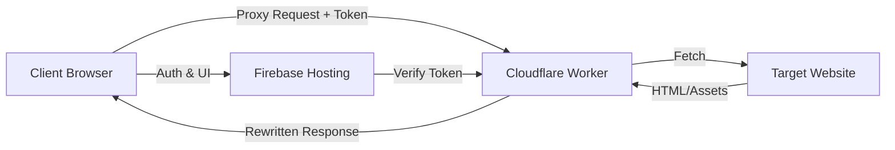

# System Architecture

OpenFamilySafe utilizes a **Serverless Hybrid Architecture** to achieve high performance and low cost (effectively free for family use). This document outlines the data flow and component interaction.

## 1. The Challenge

Traditional free-tier serverless functions (like Firebase Functions Spark Plan) often block outbound networking to non-Google services. This makes building a proxy server impossible without upgrading to a paid plan.

## 2. The Solution: Cloudflare + Firebase

We combine the strengths of two platforms:
*   **Firebase:** Excellent Authentication, Database, and Static Hosting.
*   **Cloudflare Workers:** Excellent Edge Computing with unrestricted outbound `fetch` capabilities.

### Component Diagram

## 3. Detailed Data Flow

### A. Authentication
1.  User **Registers** or **Logs in** via the React Frontend (`/login`).
2.  Firebase Auth issues a **JWT ID Token**.
3.  This token is stored in the user's session.

### B. The Proxy Request
1.  User enters a URL (e.g., `wikipedia.org`) in the Dashboard.
2.  The Frontend constructs a request to the Cloudflare Worker endpoint:
    `https://your-worker.dev/?url=https://wikipedia.org`
3.  **CRITICAL:** The request includes the Firebase ID Token in the `Authorization` header.

### C. The Worker (Backend)
1.  **Intercept:** The Cloudflare Worker receives the request.
2.  **Verify:** It validates the Firebase ID Token (using a public key set).
    *   *If invalid:* Returns 403 Forbidden.
3.  **Check Permissions:** (Optional) Checks Firestore/Cache to see if the URL is allowed for this user's role.
4.  **Fetch:** The Worker fetches the content from the Target Website.
5.  **Rewrite:**
    *   Rewrites `src` and `href` attributes to point back through the proxy.
    *   Adds CORS headers to allow the React App to render the content.
6.  **Return:** Streams the modified content back to the Client.

## 4. Security Considerations

*   **Token Verification:** The Worker must never proxy a request without a valid signature from Firebase.
*   **CORS:** The Worker is configured to only accept requests from the specific Firebase Hosting domain.
*   **HTTPS:** Communication is encrypted end-to-end.