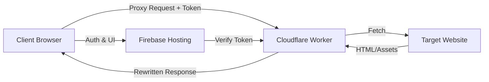
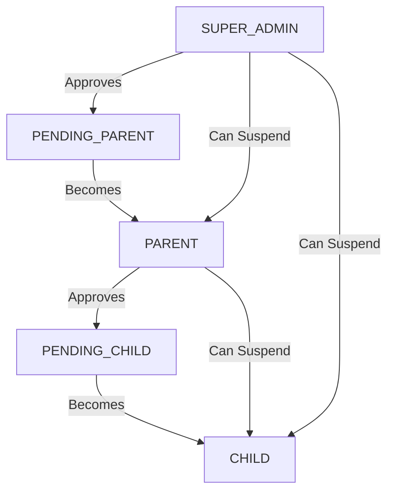
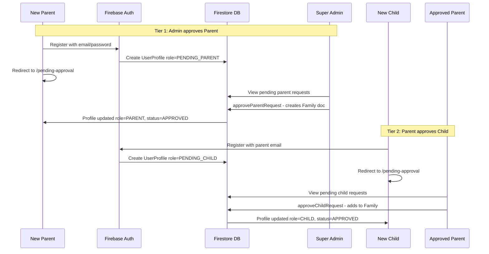

# System Architecture

OpenFamilySafe utilizes a **Serverless Hybrid Architecture** to achieve high performance and low cost (effectively free for family use). This document outlines the data flow, component interaction, and the **Two-Tier Approval System** for user onboarding.

## 1. The Challenge

Traditional free-tier serverless functions (like Firebase Functions Spark Plan) often block outbound networking to non-Google services. This makes building a proxy server impossible without upgrading to a paid plan.

## 2. The Solution: Cloudflare + Firebase

We combine the strengths of two platforms:
*   **Firebase:** Excellent Authentication, Database, and Static Hosting.
*   **Cloudflare Workers:** Excellent Edge Computing with unrestricted outbound `fetch` capabilities.

### Component Diagram



## 3. Two-Tier Approval System

OpenFamilySafe implements a hierarchical approval workflow to ensure secure onboarding:

### Role Hierarchy



### User Roles

| Role | Description | Approved By |
|------|-------------|-------------|
| `SUPER_ADMIN` | Site administrator with full access | N/A (pre-configured) |
| `PARENT` | Approved family admin who can manage children | `SUPER_ADMIN` |
| `CHILD` | Approved child with filtered proxy access | `PARENT` |
| `PENDING_PARENT` | Parent awaiting admin approval | - |
| `PENDING_CHILD` | Child awaiting parent approval | - |

### Approval Flow



### Approval Status States

*   `PENDING` - Awaiting approval from admin or parent
*   `APPROVED` - Access granted to the system
*   `REJECTED` - Request denied with reason
*   `SUSPENDED` - Account temporarily disabled

## 4. Firestore Data Schema

### Collections

#### `users` Collection
Stores all user profiles with approval state:

```typescript
interface UserProfile {
  uid: string;
  email: string;
  displayName?: string;
  role: UserRole;                    // SUPER_ADMIN | PARENT | CHILD | PENDING_PARENT | PENDING_CHILD
  filterLevel: FilterLevel;          // STRICT | MODERATE | NONE
  approvalStatus: ApprovalStatus;    // PENDING | APPROVED | REJECTED | SUSPENDED
  parentUid?: string;                // For children: their parents UID
  familyId?: string;                 // Groups parent + children together
  childrenUids?: string[];           // For parents: array of child UIDs
  approvedBy?: string;               // UID of approver
  approvedAt?: number;               // Timestamp of approval
  rejectedReason?: string;           // If rejected, why
  createdAt: number;
  updatedAt?: number;
}
```

#### `families` Collection
Groups a parent with their children:

```typescript
interface Family {
  id: string;
  parentUid: string;
  childrenUids: string[];
  createdAt: number;
  settings?: {
    filterLevel: FilterLevel;
  };
}
```

#### `invites` Collection
Stores family invite codes for child registration:

```typescript
interface Invite {
  code: string;          // 6-character alphanumeric
  familyId: string;
  createdAt: number;
  expiresAt: number;     // 48 hours from creation
}
```

#### `approvalRequests` Collection
Audit trail for approval actions:

```typescript
interface ApprovalRequest {
  id: string;
  requesterId: string;
  requesterEmail: string;
  requestType: 'PARENT_REQUEST' | 'CHILD_REQUEST';
  targetFamilyId?: string;
  status: ApprovalStatus;
  reviewerId?: string;
  reviewedAt?: number;
  createdAt: number;
  notes?: string;
}
```

## 5. Detailed Data Flow

### A. Authentication & Registration
1.  **Configuration:** The application is configured using environment variables (see `.env.example`) to ensure secrets like Firebase config and Worker URLs are not hardcoded.
2.  User **Registers** via the React Frontend (`/login`).
    *   **Parents** register with email/password → assigned `PENDING_PARENT` role
    *   **Children** register with email/password + parent's email → assigned `PENDING_CHILD` role
3.  Firebase Auth issues a **JWT ID Token**.
4.  New users are redirected to `/pending-approval` until approved.
5.  **Approval Process:**
    *   Admin approves parents via `/admin` console → creates `Family` document
    *   Parents approve children via `/family` console → adds child to family

### B. The Proxy Request
1.  **Only approved users** (SUPER_ADMIN, PARENT, CHILD with status=APPROVED) can access the Dashboard.
2.  User enters a URL (e.g., `wikipedia.org`) in the Dashboard.
3.  The Frontend constructs a request to the Cloudflare Worker endpoint:
    `https://your-worker.dev/?url=https://wikipedia.org`
4.  **CRITICAL:** The request includes the Firebase ID Token in the `Authorization` header.

### C. The Worker (Backend)
1.  **Intercept:** The Cloudflare Worker receives the request.
2.  **JWT Verification:** The Worker verifies the Firebase ID Token:
    *   Decodes the JWT and validates structure
    *   Checks expiration (`exp` claim)
    *   Validates issuer matches `https://securetoken.google.com/{FIREBASE_PROJECT_ID}`
    *   Validates audience matches the Firebase Project ID
    *   *If invalid:* Returns 401 Unauthorized
3.  **Filter Level:** Extracts `X-Filter-Level` header for content filtering.
4.  **Fetch:** The Worker fetches the content from the Target Website.
5.  **HTML Rewriting:** Uses Cloudflare's `HTMLRewriter` API to:
    *   Rewrite `src` and `href` attributes to absolute URLs
    *   Fix relative paths for images, CSS, and scripts
6.  **CORS Headers:** Adds appropriate headers for cross-origin access.
7.  **Return:** Streams the modified content back to the Client.

## 6. Security Considerations

*   **Two-Tier Approval:** No user can access the proxy without explicit admin/parent approval.
*   **JWT Verification:** The Worker validates token structure, expiration, issuer, and audience.
    *   The `FIREBASE_PROJECT_ID` is configured in `wrangler.toml` for worker-side verification.
*   **Role-Based Access:** Different roles have different capabilities:
    *   `SUPER_ADMIN`: Can approve/reject/suspend any user
    *   `PARENT`: Can approve/reject/suspend their children
    *   `CHILD`: Can only use the proxy (no management access)
*   **Account Suspension:** Admins and parents can suspend accounts, immediately revoking access.
*   **CORS:** The Worker is configured to only accept requests from authorized origins.
*   **HTTPS:** Communication is encrypted end-to-end.